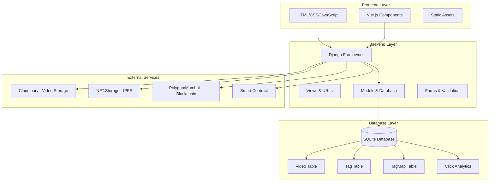
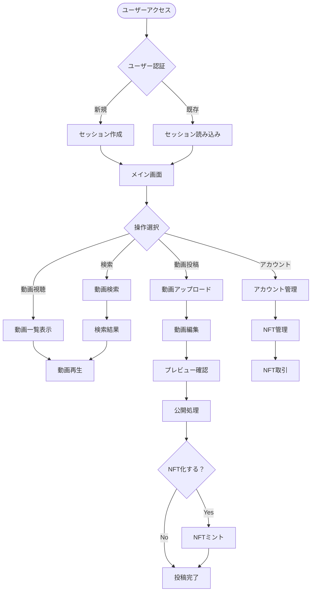
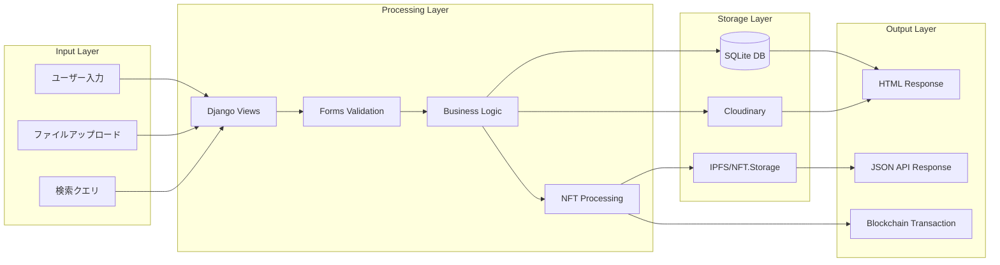
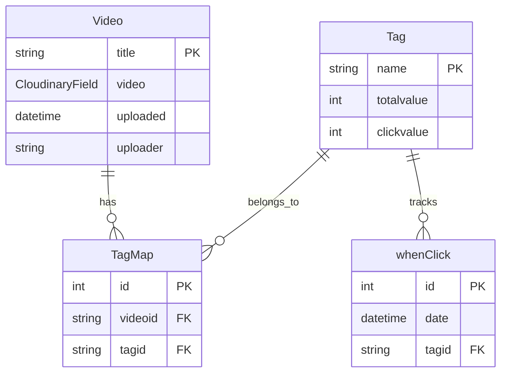

# Ano Video Post - 動画SNSプラットフォーム

卒業制作として開発された動画SNSアプリケーション。ユーザーが動画をアップロード、検索、視聴し、NFTとして動画を取引できる包括的なプラットフォームです。

## 🎯 プロジェクト概要

本プロジェクトは、動画の投稿・視聴機能に加えて、ブロックチェーン技術を活用したNFT機能を搭載した次世代型動画SNSプラットフォームです。

### 主な機能
- 📹 動画アップロード・投稿
- 🔍 動画検索・タグ検索
- 👤 ユーザーアカウント管理
- 🎨 動画編集機能
- 🪙 NFT化・取引機能
- 📊 動画統計・分析

## 🏗️ アーキテクチャ構成

### システム全体構成図



## 📁 プロジェクト構造

```
ano_video_post/
├── env1/                    # Django設定ディレクトリ
│   ├── settings.py         # アプリケーション設定
│   ├── urls.py            # ルートURL設定
│   ├── wsgi.py            # WSGI設定
│   └── asgi.py            # ASGI設定
├── videopost/              # メインアプリケーション
│   ├── models.py          # データベースモデル
│   ├── views.py           # ビュー処理
│   ├── urls.py            # URL設定
│   ├── forms.py           # フォーム定義
│   ├── nft.py             # NFT/ブロックチェーン処理
│   ├── admin.py           # 管理画面設定
│   ├── signals.py         # シグナル処理
│   ├── templates/         # HTMLテンプレート
│   │   ├── index.html     # メイン画面
│   │   ├── edit.html      # 編集画面
│   │   ├── serch.html     # 検索画面
│   │   ├── account.html   # アカウント画面
│   │   ├── check.html     # 確認画面
│   │   └── video.html     # 動画視聴画面
│   └── static/            # 静的ファイル
│       ├── css/           # スタイルシート
│       ├── js/            # JavaScript
│       ├── images/        # 画像素材
│       ├── abi/          # スマートコントラクトABI
│       └── materials/     # 一時ファイル保存
├── 設計/                   # 設計ドキュメント
│   ├── *.dio             # Draw.io図面ファイル
│   └── *.svg             # フローチャート画像
├── manage.py              # Django管理スクリプト
├── db.sqlite3            # SQLiteデータベース
└── requirements.txt      # 依存関係
```

## 🔄 アプリケーションフロー

### 1. ユーザーインタラクションフロー



### 2. データフロー図



## 🗃️ データベース設計

### ERD (Entity Relationship Diagram)



### テーブル詳細

| テーブル名 | 説明 | 主要フィールド |
|-----------|------|---------------|
| **Video** | 動画情報 | title, video, uploaded, uploader |
| **Tag** | タグ管理 | name, totalvalue, clickvalue |
| **TagMap** | 動画-タグ関連 | videoid, tagid |
| **whenClick** | クリック統計 | date, tagid |

## 🔧 技術スタック

### バックエンド
- **Framework**: Django 4.2.1
- **Database**: SQLite3
- **Storage**: Cloudinary (動画ファイル)
- **Environment**: Python 3.x

### フロントエンド
- **Core**: HTML5, CSS3, JavaScript
- **Framework**: Vue.js 3
- **Libraries**: 
  - Axios (HTTP クライアント)
  - Lodash (ユーティリティ)
  - VueUse (Vue.js composition utilities)

### ブロックチェーン & NFT
- **Blockchain**: Polygon (Mumbai Testnet)
- **Storage**: IPFS via NFT.Storage
- **Smart Contract**: Solidity (ERC-721)
- **Web3**: Web3.py
- **Wallet**: eth-account

### 外部サービス
- **Cloudinary**: 動画ストレージ・配信
- **NFT.Storage**: IPFS分散ストレージ
- **Polygon**: ブロックチェーンネットワーク

## 🚀 セットアップ・インストール

### 前提条件
```bash
Python 3.8+
pip (Python package manager)
```

### インストール手順

1. **リポジトリのクローン**
```bash
git clone <repository-url>
cd ano_video_post
```

2. **仮想環境の作成・有効化**
```bash
python -m venv venv
source venv/bin/activate  # Windows: venv\Scripts\activate
```

3. **依存関係のインストール**
```bash
pip install -r requirements.txt
```

4. **環境変数の設定**
```bash
# .envファイルを作成し、以下を設定
DJANGO_SECRET_KEY=your-secret-key
CLOUDINARY_NAME=your-cloudinary-name
CLOUDINARY_API_KEY=your-cloudinary-api-key
CLOUDINARY_API_SECRET=your-cloudinary-api-secret
NFT_STORAGE_API_KEY=your-nft-storage-api-key
WALLET_PRIVATE_KEY=your-wallet-private-key
CONTRACT_ADDRESS=your-contract-address
```

5. **データベース初期化**
```bash
python manage.py makemigrations
python manage.py migrate
```

6. **開発サーバー起動**
```bash
python manage.py runserver
```

## 📋 API エンドポイント

| エンドポイント | メソッド | 説明 |
|---------------|---------|------|
| `/videopost/` | GET | メイン画面表示 |
| `/videopost/edit` | GET/POST | 動画編集・投稿 |
| `/videopost/serch` | GET | 動画検索画面 |
| `/videopost/account` | GET | アカウント管理 |
| `/videopost/vpost/` | POST | 動画ファイルアップロード |
| `/videopost/ipost/` | POST | 画像ファイルアップロード |
| `/videopost/getTags/` | GET | タグ一覧取得 |
| `/videopost/testIpfs/` | GET | NFTミント実行 |

## 🔐 セキュリティ考慮事項

- Django標準のCSRF保護
- セッションベースのユーザー管理
- ファイルアップロード時の拡張子検証
- 環境変数による秘密鍵管理
- ブロックチェーン取引時の署名検証

## 🎨 NFT機能詳細

### NFT化プロセス
1. **動画アップロード**: Cloudinaryに動画保存
2. **サムネイル生成**: OpenCVで最適フレーム抽出
3. **IPFS保存**: NFT.StorageにメタデータとファイルをIPFS保存
4. **スマートコントラクト実行**: Polygonネットワークでミント実行
5. **取引機能**: ウォレット間でのNFT転送とMatic支払い

### スマートコントラクト機能
- `mintNFT()`: 新規NFT発行
- `transfer()`: NFT所有権転送  
- `send_matic()`: Matic通貨送金

## 📊 分析・統計機能

- **クリック数追跡**: タグ別クリック統計
- **投稿統計**: 日別投稿数分析
- **人気度測定**: タグの総合評価値計算

## 🚧 今後の拡張予定

- [ ] ユーザー認証システムの強化
- [ ] レスポンシブデザインの改善
- [ ] 動画ストリーミング最適化
- [ ] NFTマーケットプレイス機能
- [ ] ソーシャル機能（いいね、コメント）
- [ ] 高度な動画編集機能

## 👥 開発チーム

卒業制作プロジェクト - チーム開発

## 📄 ライセンス

このプロジェクトは教育目的で開発されました。